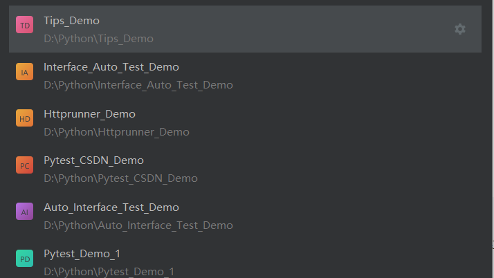
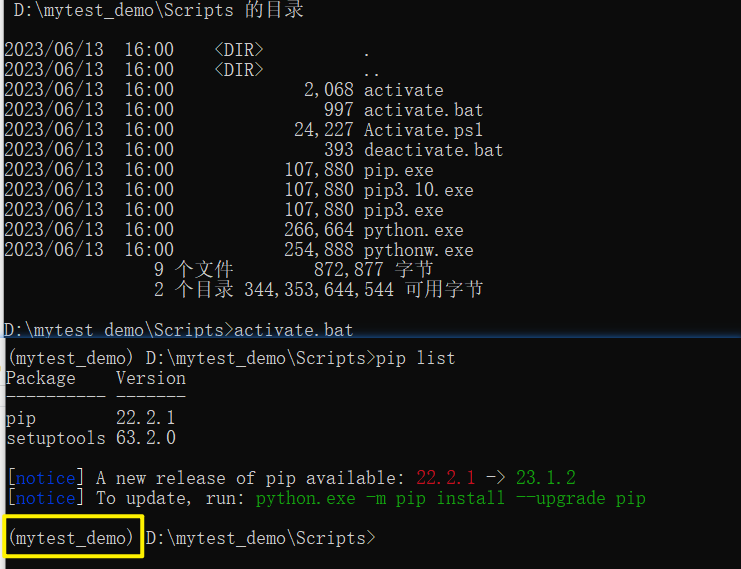
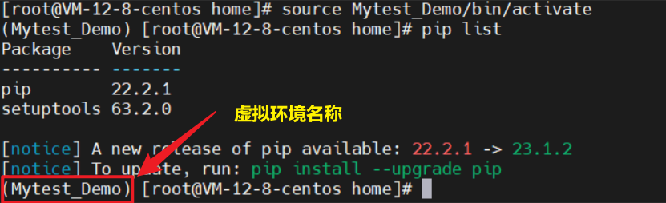
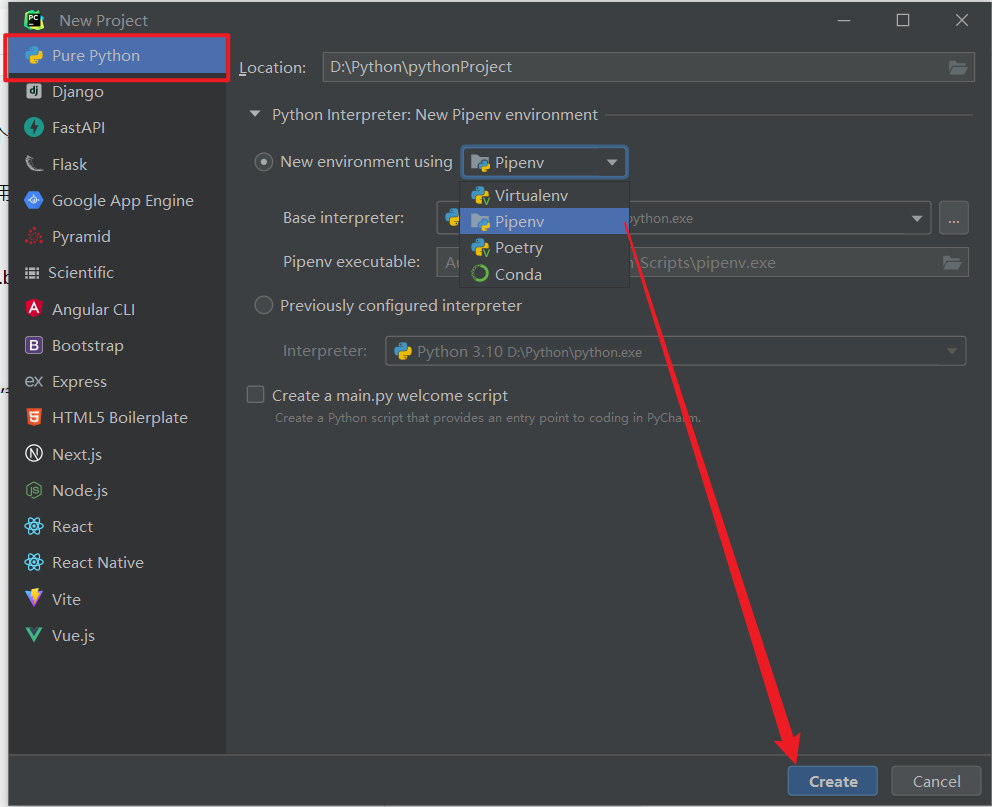
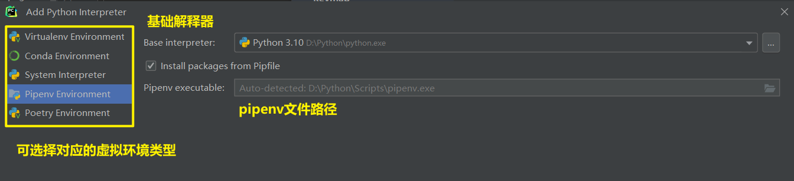

# Python如何创建虚拟环境
在我们日常的生活中，常常是在解释器中存在多个项目，为了不引起依赖不冲突，一般建议每个项目在单独隔离的环境中进行开发

## 创建虚拟环境的作用

- 虚拟环境允许在同一台计算机上同时管理多个项目，并隔离它们的依赖关系。每个虚拟环境都有自己的 Python 解释器和安装的包，使得项目之间的依赖不会相互冲突。这样可以确保每个项目都使用其特定版本的依赖包，避免因项目之间的冲突而导致的错误。
- 虚拟环境可以帮助管理不同的 Python 版本。如果需要在不同的 Python 版本下运行或测试代码，可以为每个版本创建独立的虚拟环境，并在其中安装相应的 Python 解释器和依赖包。方便地在不同的 Python 版本之间切换，而无需干扰其他项目或全局环境。
- 虚拟环境可以轻松地与其他开发者共享和部署。可以将虚拟环境的配置文件（如 requirements.txt）与项目一起共享，别人能够在相同的环境中运行你的代码（高级CV工程师）。这样可以确保每个人在相同的开发环境中工作，减少因环境差异而引起的问题。
- 虚拟环境可以简化依赖安装过程。通过在虚拟环境中使用工具如 pip 来管理依赖包，我们可以轻松地安装、更新和卸载项目所需的依赖。这使得项目能够更快地进行部署和复制。

## 创建步骤
1. 在命令行或者终端里面，cd进入到你希望创建的工作目录
2. 运行 `python -m venv mytest_Demo` 虚拟环境名称,这将会在当前目录下创建一个名为mytest_Demo的虚拟环境

3. Windows系统和MacOS、Linux环境激活命令可能不同
4. Windows环境下使用`mytest_Demo\Scripts\activate.bat `激活路径下的虚拟环境

5. MacOS或者Linux系统使用`source mytest_Demo/bin/activate`

6. 可以直接在虚拟环境内使用`pip install 依赖库名称`进行安装
7. 退出虚拟环境使用指令:`deactivate`即可退出，退出后虚拟环境将退出，并返回到系统默认的Python环境。
   
## Pycharm中创建虚拟环境
### 新建环境创建
1. 新建项目在首页专业版Pycharm 支持 直接创建虚拟环境,

### 新建虚拟环境解释器
1. 在PyCharm 的菜单栏中，选择 "File"（文件）-> "Settings"（设置）
2. 在弹出的窗口中，选择 "Python Interpreter"（Python 解释器）
3. 点击右上角的齿轮图标，选择 "Add"（添加）
4. 根据自己需求添加解释器

### 激活Pipenv虚拟环境
1. 在项目路径下，也就是存在`Pipfile`文件的目录
2. 运行`pipenv`
3. 一旦虚拟环境被激活，你将在命令行终端的提示符前看到虚拟环境的名称，表明你正在使用虚拟环境进行开发。

4. 所有的依赖包和环境变量都将限定在虚拟环境中，确保与其他项目的依赖不发生冲突。 要退出虚拟环境，可以简单地输入 exit 命令或关闭命令行终端窗口。这将会恢复到全局 Python 环境。

# End
欢迎各位小伙伴添加博主微信进行沟通，笔芯～

